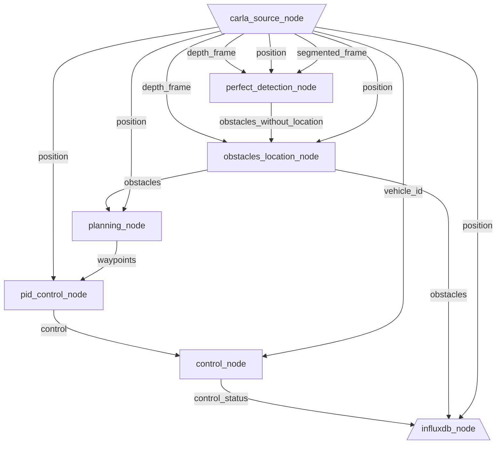

<p align="center">
    
</p>

---

`dora-drives` is the starter kit for `dora`. `dora-drives` is an autonomous vehicle that runs within the [Carla simulator](https://carla.org/).

This project is in early development, and many features have yet to be implemented with breaking changes. Please don't take for granted the current design.

---

## Requirements:
|Dependencies|Version|
|-|-|
|OS| Linux
|Python| Version 3.8
|Docker|Latest


## Getting started

```bash
git clone git@github.com:futurewei-tech/dora.git
git clone git@github.com:futurewei-tech/dora-drives.git
cd dora-drives
```

- Run with:

```bash
docker run -d -p6831:6831/udp -p6832:6832/udp -p16686:16686 jaegertracing/all-in-one:latest
# TODO: Add Maturin build script
./scripts/launch.sh
```

And then within the container:
```bash
./workspace/dora-drives/scripts/launch_in_container.sh
```

### Configuration

- Current configurations are made as top-file constant variables. Later on, they will be integrated into the graph declaration.

#### InfluxDB visualisation

- Create a free plan at:  https://cloud2.influxdata.com/signup
- Create a bucket and an API token.
- Change the current static constant variables.

### Jaeger Export

- To export to Jaeger, you will need to first launch a Jaeger container:
```
docker run -d -p6831:6831/udp -p6832:6832/udp -p16686:16686 jaegertracing/all-in-one:latest
```

### Graph

