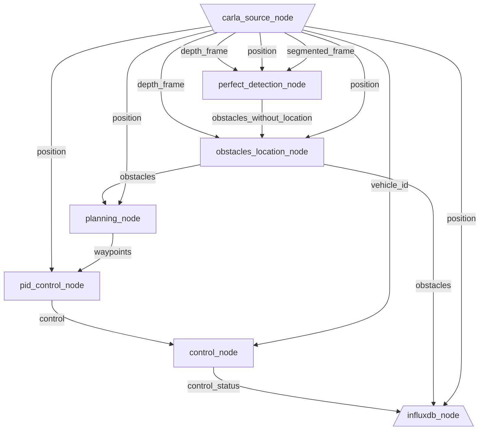

# DORA Pylot
## Getting started
### Enabling autonomous driving through Dora.

Project largely inspired by [Pylot](https://github.com/erdos-project/pylot).

Thanks the Pylot team for their contribution to open autonomous driving.

- Create a conda environment and activate it for building `dora-rs`:
```bash
conda create -n dora3.8 python=3.8
conda activate dora3.8
```
- Make sure to have [dora-rs](https://github.com/futurewei-tech/dora-rs) within the same parent folder than `dora-pylot`.
- Run with:
```bash
./launch.sh
```
> I haven't specified cross-compilation target, and depending on your OS you might need to change the compilation target.

And then within the container:
```bash
./launch_in_container.sh
```

- If you want to add a visualisation:

```bash
cd /home/erdos/workspace/dora-rs
export PYTHONPATH=$PYTHONPATH:$(pwd)/nodes
./dora-rs start-python sink_eval_plot plot image waypoints obstacles pose &
```

### Configuration

- Current configuration are made as top-file constant variables. Later on, they will be integrated into the graph declaration.

#### InfluxDB visualisation

- Create a free plan at:  https://cloud2.influxdata.com/signup
- Create a bucket and a API token.
- Change the current static constant variables.

### Jaeger Export

- To export to Jaeger, you will need to first launch a Jaeger container:
```
docker run -d -p6831:6831/udp -p6832:6832/udp -p16686:16686 jaegertracing/all-in-one:latest
```

### Graph

