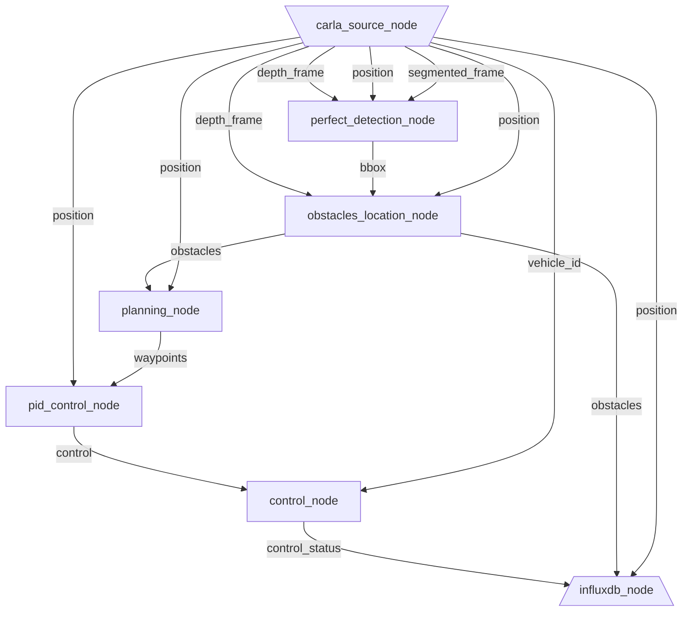

<p align="center">
    
</p>

---

`dora-drives` is the starter kit for `dora`. `dora-drives` is an autonomous vehicle that runs within the [Carla simulator](https://carla.org/).

This project is in early development, and many features have yet to be implemented with breaking changes. Please don't take for granted the current design.

---

## Documentation

The documentation can be found here: https://dora-rs.github.io/dora-drives

## Docker started

To start with docker which is the easiest:
```bash
docker pull haixuantao/dora-drives
nvidia-docker run -itd --name dora -p 20022:22 haixuantao/dora-drives /bin/bash
nvidia-docker exec -itd dora /home/dora/workspace/dora-drives/scripts/run_simulator.sh
nvidia-docker cp ~/.ssh/id_rsa.pub dora:/home/dora/.ssh/authorized_keys
nvidia-docker exec -i -t dora sudo chown dora /home/dora/.ssh/authorized_keys
nvidia-docker exec -i -t dora sudo service ssh start
ssh -p 20022 -X dora@localhost 
```

And then within the container:
```bash
./workspace/dora-drives/scripts/launch_in_container.sh
```

> This docker image has been built with my setup and it might not work on all machines. In case it doesn't work. Please check the following `Getting Started`.

## Getting started

```bash
git clone git@github.com:futurewei-tech/dora.git
git clone git@github.com:futurewei-tech/dora-drives.git
cd dora-drives
```

- Run with:

```bash
docker run -d -p6831:6831/udp -p6832:6832/udp -p16686:16686 jaegertracing/all-in-one:latest
# TODO: Add Maturin build script
./scripts/launch.sh
```

And then within the container:
```bash
./workspace/dora-drives/scripts/launch_in_container.sh
```

### Configuration

- Current configurations are made as top-file constant variables. Later on, they will be integrated into the graph declaration.

### Graph


