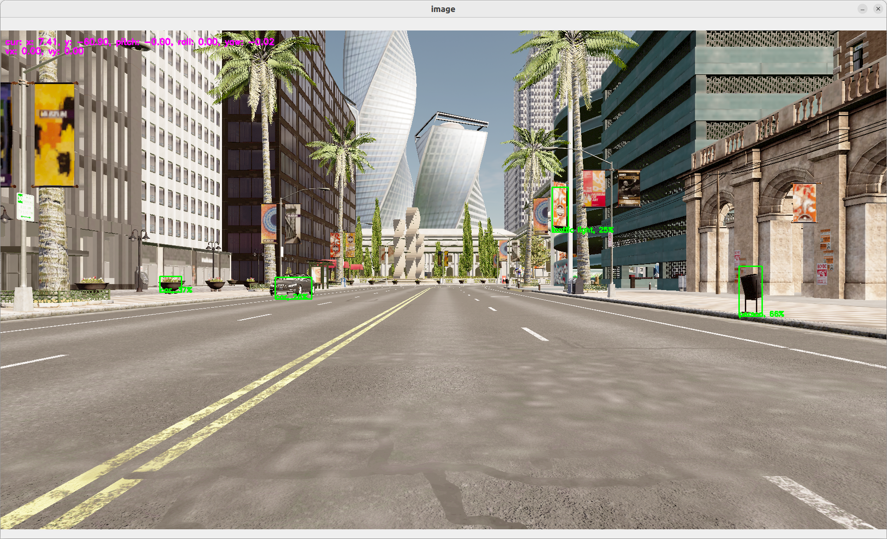

# Carla simulator

Let's try to use a car simulator to not only do perception but also control.

## Carla Setup

In the rest of the tutorial, we will accept that you have a carla simulator running at `localhost:2000` the default carla configuration.

To start a simulator make sure you have carla installed. You can check the [installation page](./installation.md) if you not sure if it's installed.

You can also a docker version or any other method provided by [Carla](https://carla.org/)

In case you have used the installation script. You should be able to run a carla simulator using 

```bash
./scripts/run_simulator.sh
```
> You can define the VULKAN interface you want to use, using the env variable `VK_ICD_FILENAMES`. 
> 
> Ex for NVIDIA: `export VK_ICD_FILENAMES="/usr/share/vulkan/icd.d/nvidia_icd.json"`

If you're using the OASIS platflorm, follow the OASIS platform to start and run your dataflow.

## Switching from the 

We can then switch from the webcam to the simulator in our graph.

```yaml
# graphs/oasis/oasis_agent_gps.yaml

{{#include ../../graphs/oasis/oasis_agent_yolov5.yaml}}
```

To run:

```bash
dora up
dora start graphs/oasis/oasis_agent_yolov5.yaml --attach
```

You should see a window showing the view from a camera within the carla simulator. On this camera stream, you should see object detection happenning.

You can <kbd>ctrl</kbd>+<kbd>c</kbd> to kill your running 
dataflow.

<p align="center">
    
</p>

> This very first step is done to show you how to connect carla simulator with dora. It does not provide any control to move the car.