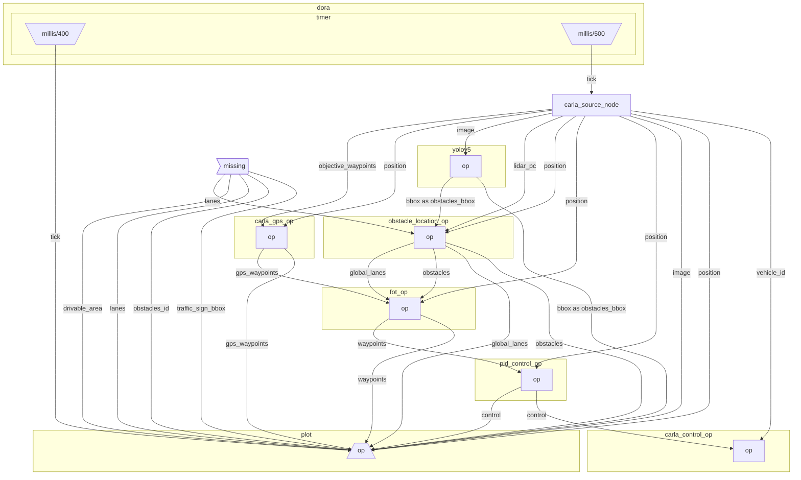

# Control

Car can simplistically be controlled in general using 3 variables: `throttle, steering, brake`. We're going to focus on those 3 for the moment.

To send a control to a Carla car, we can use `carla_control_op.py` that takes an array of 3 variables: `throttle, steering, brake` and apply it to our car.

To translate out waypoints to those control, we're using a PID controller that is able to adjust the steering according to the response of the steering, and we're going to pipe this response to the CARLA API so that the car can move. The PID controller code is in `pid_control_op.py`.

The full graph look as follows:

```yaml
{{#include ../../graphs/tutorials/carla_full.yaml}}
```

You can visualize your graph with:
```bash
dora graph graphs/tutorials/carla_full.yaml --open                 
 ```



To test it out:

```bash
./scripts/launch.sh -b -s -g tutorials/carla_full.yaml
```

- To run it without docker:

```bash
dora-daemon --run-dataflow graphs/tutorials/carla_full.yaml
```

😎 We now have a working autonomous car!