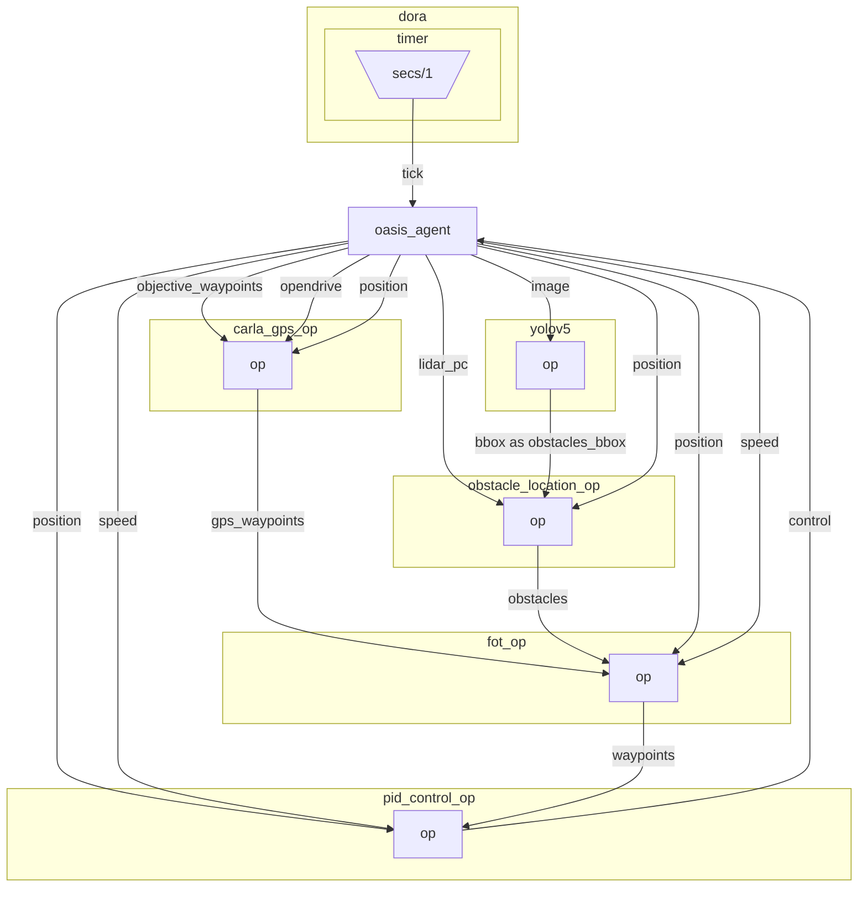

# Overview

```mermaid
        flowchart TB
  oasis_agent
subgraph carla_gps_op
  carla_gps_op/op[op]
end
subgraph yolov5
  yolov5/op[op]
end
subgraph obstacle_location_op
  obstacle_location_op/op[op]
end
subgraph fot_op
  fot_op/op[op]
end
subgraph pid_control_op
  pid_control_op/op[op]
end
subgraph ___dora___ [dora]
  subgraph ___timer_timer___ [timer]
    dora/timer/secs/1[\secs/1/]
  end
end
  pid_control_op/op -- control --> oasis_agent
  dora/timer/secs/1 -- tick --> oasis_agent
  oasis_agent -- objective_waypoints --> carla_gps_op/op
  oasis_agent -- opendrive --> carla_gps_op/op
  oasis_agent -- position --> carla_gps_op/op
  oasis_agent -- image --> yolov5/op
  oasis_agent -- lidar_pc --> obstacle_location_op/op
  yolov5/op -- bbox as obstacles_bbox --> obstacle_location_op/op
  oasis_agent -- position --> obstacle_location_op/op
  carla_gps_op/op -- gps_waypoints --> fot_op/op
  obstacle_location_op/op -- obstacles --> fot_op/op
  oasis_agent -- position --> fot_op/op
  oasis_agent -- speed --> fot_op/op
  oasis_agent -- position --> pid_control_op/op
  oasis_agent -- speed --> pid_control_op/op
  fot_op/op -- waypoints --> pid_control_op/op
```
