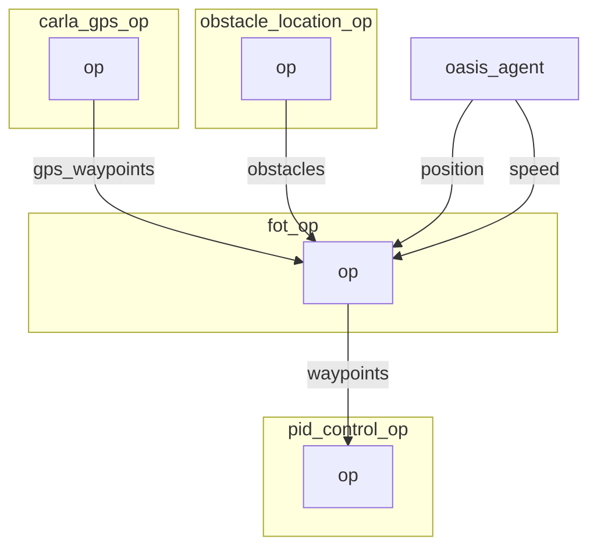

# FOT operator

The Frenet Optimal Planner Operator is based on [https://github.com/erdos-project/frenet_optimal_trajectory_planner/](https://github.com/erdos-project/frenet_optimal_trajectory_planner/) and wrap the different elements `obstacles`, `position`, `speed` ... into a frenet consumable format. 


FOT inputs are:
```python
initial_conditions = {
    "ps": 0,
    "target_speed": # The target speed
    "pos": # The x, y current position
    "vel": # The vx, vy current speed
    "wp": # [[x, y], ... n_waypoints ] desired waypoints
    "obs": # [[min_x, min_y, max_x, max_y], ... ] obstacles on the way
}
```
There is also a set of hyperparameters that are described below.

As our obstacles are defined as 3D dot we need to transform those dot into `[min_x, min_y, max_x, max_y]` format. We do that within the `get_obstacle_list` function. This approximation is very basic and probably need to be revisited.

The output is either a successful trajectory that we can feed into PID. Or it is a failure in which case we send the current position as waypoint.

## Graph Description

```yaml
  - id: fot_op
    operator:
      python: ../../operators/fot_op.py
      outputs:
        - waypoints
      inputs:
        position: oasis_agent/position
        speed: oasis_agent/speed
        obstacles: obstacle_location_op/obstacles
        gps_waypoints: carla_gps_op/gps_waypoints
```

## Graph Viz



## Hyperparameter descriptions

```bash
        initial_conditions (dict): dict containing the following items
            ps (float): previous longitudinal position
            target_speed (float): target speed [m/s]
            pos (np.ndarray([float, float])): initial position in global coord
            vel (np.ndarray([float, float])): initial velocity [m/s]
            wp (np.ndarray([float, float])): list of global waypoints
            obs (np.ndarray([float, float, float, float])): list of obstacles
                as: [lower left x, lower left y, upper right x, upper right y]
        hyperparameters (dict): a dict of optional hyperparameters
            max_speed (float): maximum speed [m/s]
            max_accel (float): maximum acceleration [m/s^2]
            max_curvature (float): maximum curvature [1/m]
            max_road_width_l (float): maximum road width to the left [m]
            max_road_width_r (float): maximum road width to the right [m]
            d_road_w (float): road width sampling discretization [m]
            dt (float): time sampling discretization [s]
            maxt (float): max prediction horizon [s]
            mint (float): min prediction horizon [s]
            d_t_s (float): target speed sampling discretization [m/s]
            n_s_sample (float): sampling number of target speed
            obstacle_clearance (float): obstacle radius [m]
            kd (float): positional deviation cost
            kv (float): velocity cost
            ka (float): acceleration cost
            kj (float): jerk cost
            kt (float): time cost
            ko (float): dist to obstacle cost
            klat (float): lateral cost
            klon (float): longitudinal cost
    Returns:
        result_x (np.ndarray(float)): x positions of fot, if it exists
        result_y (np.ndarray(float)): y positions of fot, if it exists
        speeds (np.ndarray(float)): speeds of fot, if it exists
        ix (np.ndarray(float)): spline x of fot, if it exists
        iy (np.ndarray(float)): spline y of fot, if it exists
        iyaw (np.ndarray(float)): spline yaws of fot, if it exists
        d (np.ndarray(float)): lateral offset of fot, if it exists
        s (np.ndarray(float)): longitudinal offset of fot, if it exists
        speeds_x (np.ndarray(float)): x speeds of fot, if it exists
        speeds_y (np.ndarray(float)): y speeds of fot, if it exists
        params (dict): next frenet coordinates, if they exist
        costs (dict): costs of best frenet path, if it exists
        success (bool): whether a fot was found or not

```
Ref: https://github.com/erdos-project/frenet_optimal_trajectory_planner/blob/master/FrenetOptimalTrajectory/fot_wrapper.py