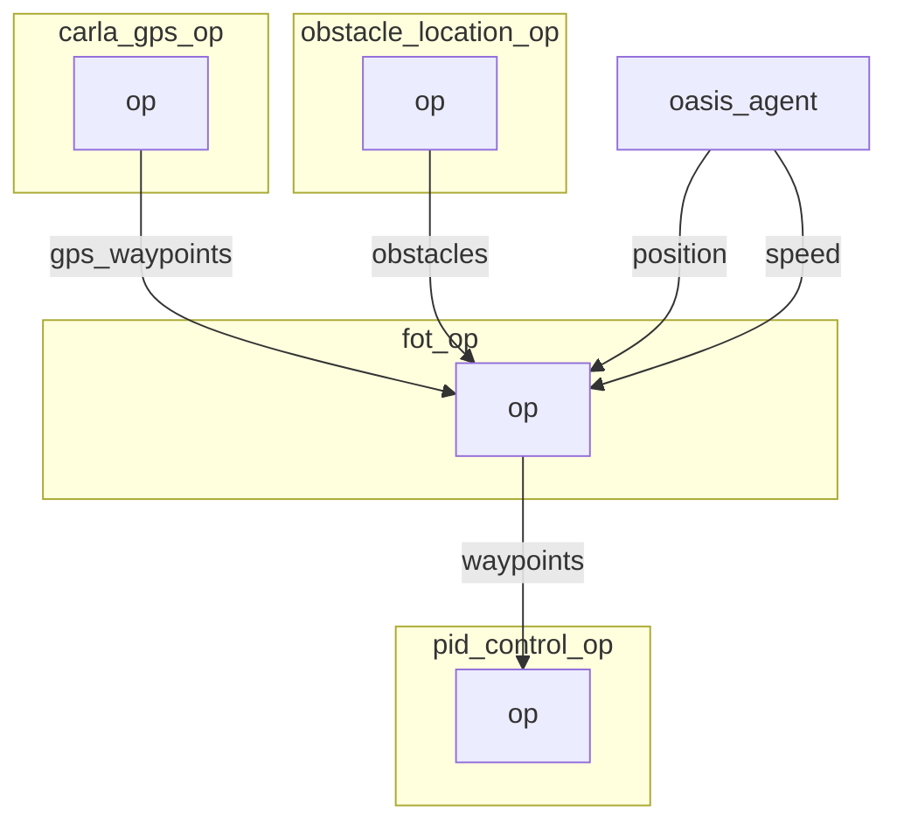

# FOT operator


## Graph Description

```yaml
  - id: fot_op
    operator:
      python: ../../operators/fot_op.py
      outputs:
        - waypoints
      inputs:
        position: oasis_agent/position
        speed: oasis_agent/speed
        obstacles: obstacle_location_op/obstacles
        gps_waypoints: carla_gps_op/gps_waypoints
```

## Graph Viz




## Hyper Parameters to consider 

See: https://github.com/erdos-project/frenet_optimal_trajectory_planner

```python
        self.hyperparameters = {
            "max_speed": 25.0,
            "max_accel": 45.0,
            "max_curvature": 55.0,
            "max_road_width_l": 0.1,
            "max_road_width_r": 0.1,
            "d_road_w": 0.5,
            "dt": 0.5,
            "maxt": 5.0,
            "mint": 2.0,
            "d_t_s": 5,
            "n_s_sample": 2.0,
            "obstacle_clearance": 0.1,
            "kd": 1.0,
            "kv": 0.1,
            "ka": 0.1,
            "kj": 0.1,
            "kt": 0.1,
            "ko": 0.1,
            "klat": 1.0,
            "klon": 1.0,
            "num_threads": 0,  # set 0 to avoid using threaded algorithm
        }
```

```bash
        initial_conditions (dict): dict containing the following items
            ps (float): previous longitudinal position
            target_speed (float): target speed [m/s]
            pos (np.ndarray([float, float])): initial position in global coord
            vel (np.ndarray([float, float])): initial velocity [m/s]
            wp (np.ndarray([float, float])): list of global waypoints
            obs (np.ndarray([float, float, float, float])): list of obstacles
                as: [lower left x, lower left y, upper right x, upper right y]
        hyperparameters (dict): a dict of optional hyperparameters
            max_speed (float): maximum speed [m/s]
            max_accel (float): maximum acceleration [m/s^2]
            max_curvature (float): maximum curvature [1/m]
            max_road_width_l (float): maximum road width to the left [m]
            max_road_width_r (float): maximum road width to the right [m]
            d_road_w (float): road width sampling discretization [m]
            dt (float): time sampling discretization [s]
            maxt (float): max prediction horizon [s]
            mint (float): min prediction horizon [s]
            d_t_s (float): target speed sampling discretization [m/s]
            n_s_sample (float): sampling number of target speed
            obstacle_clearance (float): obstacle radius [m]
            kd (float): positional deviation cost
            kv (float): velocity cost
            ka (float): acceleration cost
            kj (float): jerk cost
            kt (float): time cost
            ko (float): dist to obstacle cost
            klat (float): lateral cost
            klon (float): longitudinal cost
    Returns:
        result_x (np.ndarray(float)): x positions of fot, if it exists
        result_y (np.ndarray(float)): y positions of fot, if it exists
        speeds (np.ndarray(float)): speeds of fot, if it exists
        ix (np.ndarray(float)): spline x of fot, if it exists
        iy (np.ndarray(float)): spline y of fot, if it exists
        iyaw (np.ndarray(float)): spline yaws of fot, if it exists
        d (np.ndarray(float)): lateral offset of fot, if it exists
        s (np.ndarray(float)): longitudinal offset of fot, if it exists
        speeds_x (np.ndarray(float)): x speeds of fot, if it exists
        speeds_y (np.ndarray(float)): y speeds of fot, if it exists
        params (dict): next frenet coordinates, if they exist
        costs (dict): costs of best frenet path, if it exists
        success (bool): whether a fot was found or not

```
Ref: https://github.com/erdos-project/frenet_optimal_trajectory_planner/blob/master/FrenetOptimalTrajectory/fot_wrapper.py