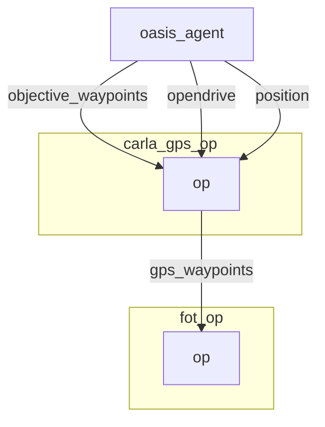

# GPS operator


## Graph Description

```yaml
  - id: carla_gps_op
    operator:
      python: ../../carla/carla_gps_op.py
      outputs:
        - gps_waypoints
      inputs:
        opendrive: oasis_agent/opendrive
        objective_waypoints: oasis_agent/objective_waypoints
        position: oasis_agent/position
```

## Graph Viz

