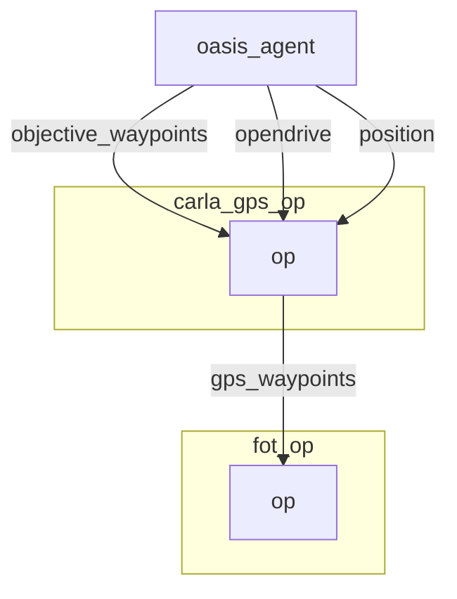

# GPS operator

The GPS Operator take a map a current position and wished waypoints
and compute the best route to go to the wished waypoint.

It does by using `carla.GlobalRoutePlanner`. This modules takes an
`opendrive` map as an input and can compute most efficient route between 
two points.
- The caching of result such that we don't compute it every single time. The computation of route is really costly.
```python
# Used cached waypoints but start at closest point.
if len(self.waypoints) != 0:
    (index, _) = closest_vertex(
        self.waypoints,
        np.array([self.position[:2]]),
    )

    self.waypoints = self.waypoints[
        index : index + NUM_WAYPOINTS_AHEAD
    ]
    self.target_speeds = self.target_speeds[
        index : index + NUM_WAYPOINTS_AHEAD
    ]
```
- The computation of the gps waypoints happens here:
```python
# Compute the waypoints
waypoints = self.hd_map.compute_waypoints(
    [
        x,
        y,
        self._goal_location[2],
    ],
    self._goal_location,
```

> Sometimes the computation might put the position on the wrong side of the road.
> I have put a failsafe mecanism, but that might have other consequences. You can try to revisit this part.
> To increase the precision of the map, you can change the parameters in `_hd_map.py`:
> ```python
>        self._grp = GlobalRoutePlanner(
>            self._map, 1.0
>        )  # Distance between waypoints
>```


## Graph Description

```yaml
  - id: carla_gps_op
    operator:
      python: ../../carla/carla_gps_op.py
      outputs:
        - gps_waypoints
      inputs:
        opendrive: oasis_agent/opendrive
        objective_waypoints: oasis_agent/objective_waypoints
        position: oasis_agent/position
```

## Graph Viz

