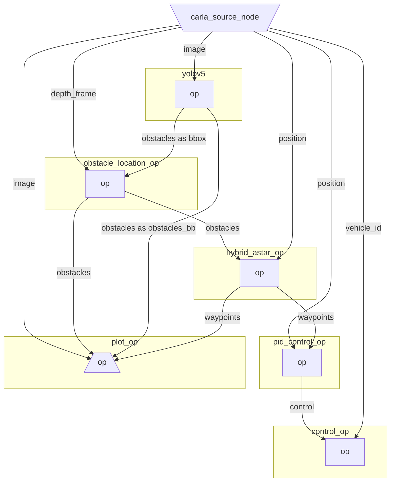

    

# Introduction

`dora-drives` is the starter kit for `dora`. `dora-drives` is an autonomous vehicle that runs within the [Carla simulator](https://carla.org/).

This project is in early development, and many features have yet to be implemented with breaking changes. Please don't take for granted the current design.

# Current Operators

Currently `dora-drives` is made of:

- A Carla source node that generates pedestrians, vehicles, as well as an `ego` vehicle with camera and sensors attached to it.
- A perfect object detection operator that use information from the simulator to generate bounding box on image frame.
- A `yolov5` object detection operator that generates bounding boxes on images where it detects object. 
- An obstacle location operator that match bouding box with depth frame images, to get the exact location of an obstacle.
- A `hybrid_astar` operator that avoid obstacles detected and use cartography information when there is no obstacles.
- A `pid` control operator that computes the command that needs to be executed to follow the `hybrid_astar` waypoints.
- A control operator that sends the command to the Carla simulator.
- A plot operator that plots: bounding boxes, obstacles locations, and waypoints on a frame and displays it.

## ⚖️ LICENSE 

This project is licensed under Apache-2.0. Check out [NOTICE.md](NOTICE.md) for more information.

