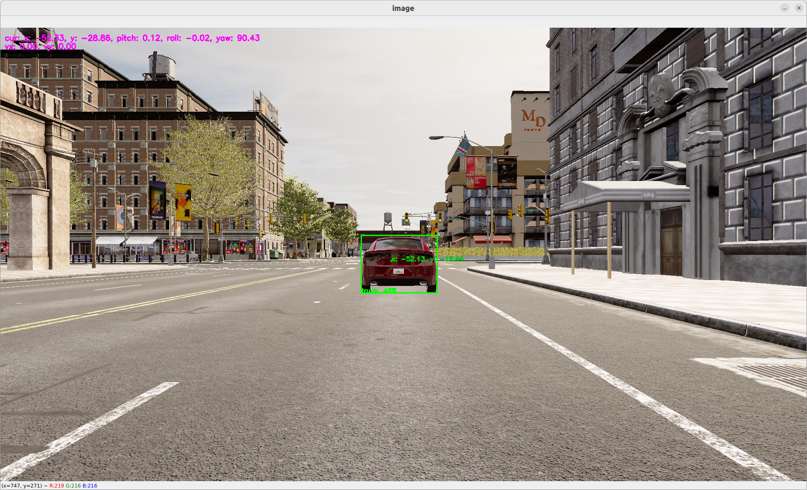

# Obstacle location

The carla simulator gives us the possibility to work with many more sensors than just a camera feed. We can emulate an LIDAR, IMU, Depth sensor, Segmentation sensor...

Let's use the LIDAR sensor to locate the exact position of the obstacle that has been located by `yolov5`.

> Details on lidar point cloud:
> The lidar point cloud is an array of `x, y, z, intensity` points.
> 
> The coordinates are based on Unreal Engine coordinate system which is: 
> - z is up
> - x is forward
> - y is right
> 
>  More info: [https://www.techarthub.com/a-practical-guide-to-unreal-engine-4s-coordinate-system/](https://www.techarthub.com/a-practical-guide-to-unreal-engine-4s-coordinate-system/)
> 
> and within carla documentation: [https://carla.readthedocs.io/en/latest/ref_sensors/#lidar-sensor](https://carla.readthedocs.io/en/latest/ref_sensors/#lidar-sensor)
> 
> You can also check velodyne reference: [https://github.com/ros-drivers/velodyne/blob/master/velodyne_pcl/README.md](https://github.com/ros-drivers/velodyne/blob/master/velodyne_pcl/README.md)

To get the obstacle location, we are going to compute the angle of every points in the point cloud. We can then map the angle of each pixel of the bounding box to a real point and therefore infere its location. We then transform the coordinate from the relative lIDAR coordinate system into a global coordinate system by adding the current position of the LIDAR sensor. The code can be found here: [`operators/obstacle_location_op.py`](https://github.com/dora-rs/dora-drives/blob/main/operators/obstacle_location_op.py). 

To use the obstacle location, just add it to the graph with:

```yaml
# graphs/oasis/oasis_agent_obstacle_location.yaml

{{#include ../../graphs/oasis/oasis_agent_obstacle_location.yaml}}
```

To run: 

```bash
dora up
dora start graphs/oasis/oasis_agent_obstacle_location.yaml --attach
```

You should be able to see a dot within the bounding box representing the estimated location in global coordinate of the obstacle.

<p align="center">
    
</p>

> For more information on `obstacle_location`, go on [our `obstacle_location` detail page](./obstacle_location_operator.md)