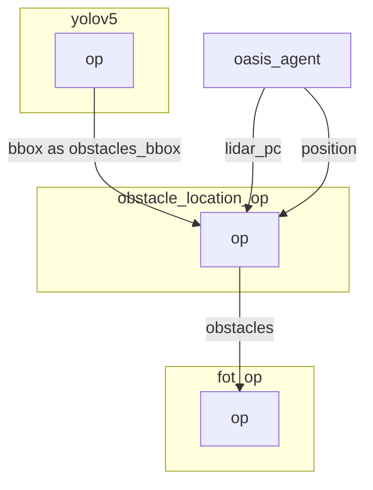

# Obstacle location operator

The obstacle location operator match bounding box with depth frame to find the exact position of obstacles.

## Inputs

- Obstacles bounding box.

## Outputs

- GPS location of obstacles.


## Graph Description

```yaml
  - id: obstacle_location_op
    operator: 
      outputs:
        - obstacles
      inputs:
        lidar_pc: oasis_agent/lidar_pc
        obstacles_bbox: yolov5/bbox
        position: oasis_agent/position
      python: ../../operators/obstacle_location_op.py
```

## Graph Viz

