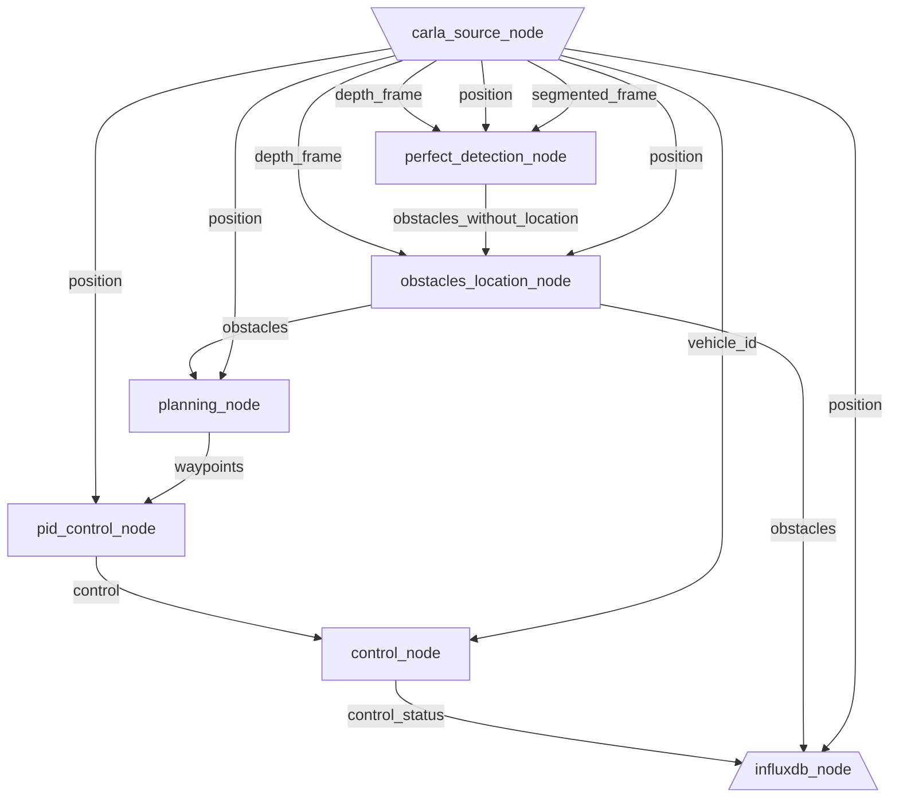

### Graph

```mermaid
flowchart TB
  carla_source_node[\carla_source_node/]
  perfect_detection_node
  obstacles_location_node
  planning_node
  pid_control_node
  control_node
  influxdb_node[/influxdb_node\]
  carla_source_node -- depth_frame --> perfect_detection_node
  carla_source_node -- position --> perfect_detection_node
  carla_source_node -- segmented_frame --> perfect_detection_node
  carla_source_node -- depth_frame --> obstacles_location_node
  perfect_detection_node -- obstacles_without_location --> obstacles_location_node
  carla_source_node -- position --> obstacles_location_node
  obstacles_location_node -- obstacles --> planning_node
  carla_source_node -- position --> planning_node
  carla_source_node -- position --> pid_control_node
  planning_node -- waypoints --> pid_control_node
  pid_control_node -- control --> control_node
  carla_source_node -- vehicle_id --> control_node
  control_node -- control_status --> influxdb_node
  obstacles_location_node -- obstacles --> influxdb_node
  carla_source_node -- position --> influxdb_node

```