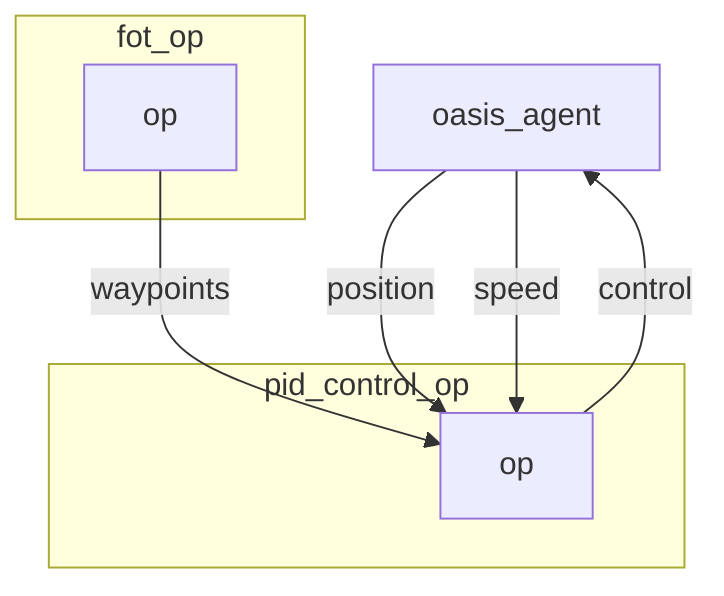

# PID Control operator

`pid` control operator computes the command that needs to be executed to follow the `hybrid_astar` waypoints.

## Inputs

- waypoints coordinates to follow.

## Outputs

- Command control.

## Graph Description

```yaml
  - id: pid_control_op
    operator:
      python: ../../operators/pid_control_op.py
      outputs:
        - control
      inputs:
        position: oasis_agent/position
        speed: oasis_agent/speed
        waypoints: fot_op/waypoints
```

## Graph Viz



## Hyperparameters consider changing

See: https://en.wikipedia.org/wiki/PID_controller

```
pid_p = 0.1
pid_d = 0.0
pid_i = 0.05
dt = 1.0 / 20   
```

<p align="center">

</p>