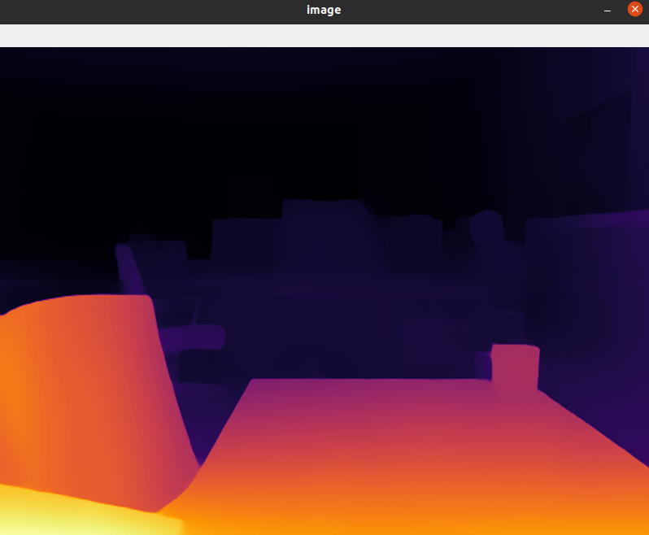

# Depth estimation example

MiDaS models for computing relative depth from a single image.

> MiDaS computes relative inverse depth from a single image. The repository provides multiple models that cover different use cases ranging from a small, high-speed model to a very large model that provide the highest accuracy. The models have been trained on 10 distinct datasets using multi-objective optimization to ensure high quality on a wide range of inputs.
Let's add all `dora-drives` operators that works on image frame, which are:
- `webcam` plug in a camera.
- `single_dpt` computing relative depth from a single image.
- `plot` take almost all output from the graph and plot it on the camera frame.

the graph will look as follows:
```yaml
# graphs/tutorials/webcam_midas_frame.yaml

{{#include ../../graphs/tutorials/webcam_midas_frame.yaml}}
```

### MiDaS source code:
If you are in mainland China, you may need a network proxy to speed up the download.
```bash
cd $DORA_DEP_HOME/dependencies/
git clone git@github.com:isl-org/MiDaS.git
cd MiDaS/weights
wget https://github.com/isl-org/MiDaS/releases/download/v3_1/dpt_beit_large_512.pt
cp dpt_beit_large_512.pt $HOME/.cache/torch/hub/checkpoints/
```

### Custom configuration

1) Pick one or more models and download the corresponding weights to the `weights` folder:

   - MiDaS 3.1
     - For highest quality: [dpt_beit_large_512](https://github.com/isl-org/MiDaS/releases/download/v3_1/dpt_beit_large_512.pt)
     - For moderately less quality, but better speed-performance trade-off: [dpt_swin2_large_384](https://github.com/isl-org/MiDaS/releases/download/v3_1/dpt_swin2_large_384.pt)
     - For embedded devices: [dpt_swin2_tiny_256](https://github.com/isl-org/MiDaS/releases/download/v3_1/dpt_swin2_tiny_256.pt), [dpt_levit_224](https://github.com/isl-org/MiDaS/releases/download/v3_1/dpt_levit_224.pt)
     - For inference on Intel CPUs, OpenVINO may be used for the small legacy model: openvino_midas_v21_small [.xml](https://github.com/isl-org/MiDaS/releases/download/v3_1/openvino_midas_v21_small_256.xml), [.bin](https://github.com/isl-org/MiDaS/releases/download/v3_1/openvino_midas_v21_small_256.bin)

   - MiDaS 3.0: Legacy transformer models [dpt_large_384](https://github.com/isl-org/MiDaS/releases/download/v3/dpt_large_384.pt) and [dpt_hybrid_384](https://github.com/isl-org/MiDaS/releases/download/v3/dpt_hybrid_384.pt)

   - MiDaS 2.1: Legacy convolutional models [midas_v21_384](https://github.com/isl-org/MiDaS/releases/download/v2_1/midas_v21_384.pt) and [midas_v21_small_256](https://github.com/isl-org/MiDaS/releases/download/v2_1/midas_v21_small_256.pt) 

2) where ```<MODEL_TYPE>``` is chosen from 
   - PT_Large     # MiDaS v3 - Large     (highest accuracy, slowest inference speed)
   - DPT_Hybrid   # MiDaS v3 - Hybrid    (medium accuracy, medium inference speed)
   - MiDaS_small  # MiDaS v2.1 - Small   (lowest accuracy, highest inference speed)

3) Other descriptive information
In this case, we have connected the `webcam/image` output to the `image` input of single_dpt. `single_dpt/depth_frame` is then connected to the `plot/image`.
Inputs are prefixed by the node name to be able to separate name conflicts.

### To run: 

```bash
dora up
dora start graphs/tutorials/webcam_single_dpt_frame.yaml --attach --hot-reload --name dpt_midas
```

Display as follows:
<p align="center">
    
</p>

> I'm currently having issue running all nodes behind the GFW. You can look into it for inspiration.

Nice 🥳 As you can see, the value of `dora` comes from the idea that you can compose different algorithm really quickly.