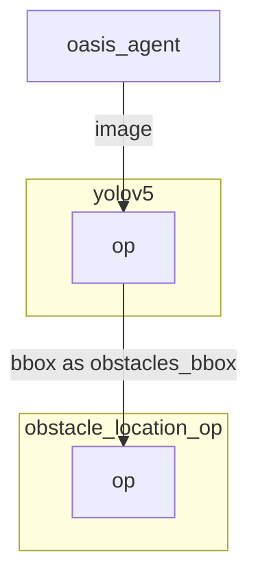

# Yolov5 operator

`Yolov5` object detection operator generates bounding boxes on images where it detects object. 

`Yolov5` has not been finetuned on the simulation and is directly importing weight from Pytorch Hub.

## Inputs

- jpeg encoded image as input.

## Outputs

- Bounding box coordinates as well as the confidence and class label as output.


## Graph Description

```yaml
  - id: yolov5
    operator: 
      outputs:
        - bbox
      inputs:
        image: oasis_agent/image
      python: ../../operators/yolov5_op.py
```

## Graph Viz

