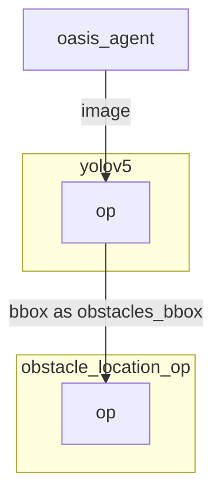

# Yolov5 operator

`Yolov5` object detection operator generates bounding boxes on images where it detects object. 

More info here: [https://github.com/ultralytics/yolov5](https://github.com/ultralytics/yolov5)

`Yolov5` has not been finetuned on the simulation and is directly importing weight from Pytorch Hub.

In case you want to run `yolov5` without internet you can clone [https://github.com/ultralytics/yolov5](https://github.com/ultralytics/yolov5) and download the weights you want to use from [the release page](https://github.com/ultralytics/yolov5/releases/tag/v7.0) and then specify within the yaml graph the two environments variables:
- `YOLOV5_PATH: YOUR/PATH` 
- `YOLOV5_WEIGHT_PATH: YOUR/WEIGHT/PATH`

You can also choose to allocate the model in GPU using the environment variable:
- `PYTORCH_DEVICE: cuda # or cpu`

The image size must be specified in order to work. By default it is 1920x1080xBGR.

## Inputs

- image as1920x1080xBGR array.

## Outputs

- Bounding box coordinates as well as the confidence and class label as output.

## Graph Description

```yaml
  - id: yolov5
    operator: 
      outputs:
        - bbox
      inputs:
        image: oasis_agent/image
      python: ../../operators/yolov5_op.py
    env:
      PYTORCH_DEVICE: cuda
      YOLOV5_PATH:       /home/dora/workspace/simulate/team_code/dependencies/yolov5 
      YOLOV5_WEIGHT_PATH:  /home/dora/workspace/simulate/team_code/dependencies/yolov5/yolov5n.pt
```

## Graph Viz


